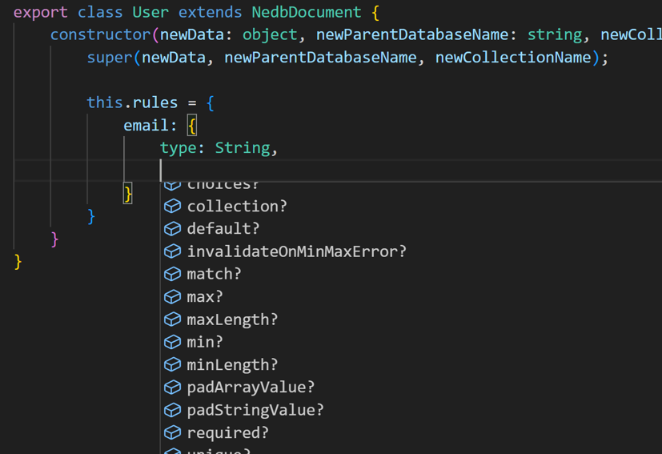

There are some cool things that you can do with this package!

## TypeScript's Improved Intellisense

TypeScript can pick up more information from this package than regular JavaScript can. This isn't a huge deal, but it does help in some situations, such as when you're declaring the rules within a document.

When your cursor is within a rule object, you can enter a keyboard shortcut to show all compatible values based on your cursor's position. In TypeScript, this will show all possible constraints that you can define in a document's rule. Like so:




## Document Inheritance

Documents can inherit from other documents!

This can help you simplify document definitions in larger, more-complex databases.

```js
class Adventurer extends NedbDocument {
	constructor(newData, newParentDatabaseName, newCollectionName){
		super(newData, newParentDatabaseName, newCollectionName);

		this.rules = {
			name: {
				type: String,
				required: true,
				unique: true
			},
			maxHealth: {
				type: Number,
				required: true,
				min: 100,
				invalidateOnMinMaxError: true
			},
			currentHealth: {
				type: Number,
				required: true,
				min: 0,
				max: this.rules.maxHealth
			}
		}	
	}
}

class Wizard extends Adventurer {
	constructor(newData, newParentDatabaseName, newCollectionName){
		super(newData, newParentDatabaseName, newCollectionName);

		let wizardRules = {
			spells: {
				type: [String],
				required: true,
				default: ["Fireball"]
			},
			maxHealth: {
				type: Number,
				required: true,
				min: 10000,
				invalidateOnMinMaxError: false
			}
		}	

		this.rules = {...this.rules, ...wizardRules};
	}
}
```

In the code above, any documents based on the `Wizard` document will also have a `name` and `currentHealth` property. They have a `maxHealth` property too, and it has different constraints or rules to the original `Adventurer` document.

This works because the `Wizard` document contains a line of code that combines the `Adventurer` document's rules with a locally-declared object of rules. This line:

```js
this.rules = {...this.rules, ...wizardRules};
```

The `...this.rules` is accessing the `Adventurer`'s rules, due to the fancy way that JavaScript handles the `this` keyword. It then combines that with the `wizardRules` object as a new object, assigned to the `Wizard`'s rules.

## NedbClient Inheritance

If you ever need to add or change functionality of a `NedbClient` but don't want to modify this package's source code, you can inherit from the `NedbClient` and make your own!

```js
class CustomClient extends NedbClient {
	constructor(dbName, dbDirectoryPath, collectionsList, coolFactor){
		super(dbName, dbDirectoryPath, collectionsList);

		this.coolFactor = coolFactor || 10;
	}
}
```